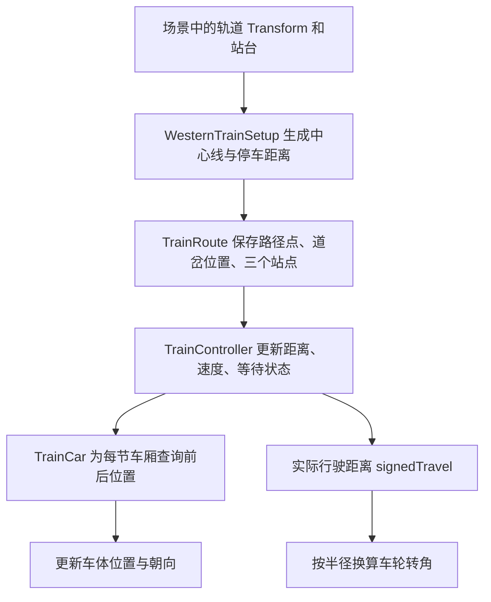
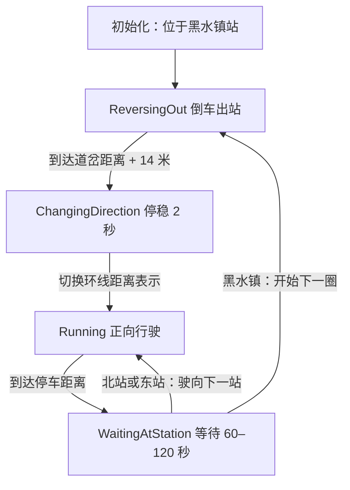

# 火车系统实现原理

这套系统先把场景中的轨道转换为一条有顺序的中心线，再用“沿中心线走了多少米”表示火车的位置。运行时，控制器更新这个距离，每节车厢根据距离计算自己的位置和朝向，车轮根据本次行驶距离计算转角。

理解整个系统的关键是：**轨道模型提供几何形状，路径距离控制列车运动，状态机控制停车和折返。**

本文说明当前代码实际执行的逻辑。系统所在目录为：

`D:\WorkSpace\Unity-Project\Game-Project\Assets\Scripts\My Scripts\TrainSystem`

## 1. 各个脚本负责什么

| 脚本 | 主要职责 | 执行阶段 |
| --- | --- | --- |
| [WesternTrainSetup.cs](</D:/WorkSpace/Unity-Project/Game-Project/Assets/Scripts/My Scripts/TrainSystem/Authoring/WesternTrainSetup.cs>) | 识别轨道和站台，生成路线，实例化火车，配置停车点 | 编辑模式，由菜单执行 |
| [TrainRoute.cs](</D:/WorkSpace/Unity-Project/Game-Project/Assets/Scripts/My Scripts/TrainSystem/Runtime/TrainRoute.cs>) | 保存路线点，计算累计距离，查询某个距离对应的位置 | 编辑模式配置，运行时查询 |
| [TrainController.cs](</D:/WorkSpace/Unity-Project/Game-Project/Assets/Scripts/My Scripts/TrainSystem/Runtime/TrainController.cs>) | 控制速度、停车等待、站点顺序和黑水镇折返 | 运行时 |
| [TrainCar.cs](</D:/WorkSpace/Unity-Project/Game-Project/Assets/Scripts/My Scripts/TrainSystem/Runtime/TrainCar.cs>) | 计算每节车厢的位置与朝向，转动独立车轮 | 配置时摆放，运行时更新 |
| [TrainServiceTests.cs](</D:/WorkSpace/Unity-Project/Game-Project/Assets/Scripts/My Scripts/TrainSystem/Tests/TrainServiceTests.cs>) | 验证停站顺序、停靠时间、折返连续性等行为 | Unity EditMode 测试 |

数据流如下：



MCP 用于配置和检查 Unity 编辑器。火车进入游戏后的行驶逻辑由这些 C# 组件执行，不需要 MCP 持续连接。

## 2. 火车是怎样识别路线的

### 2.1 在编辑模式找到轨道

路线生成入口是 `WesternTrainSetup.BuildCenterLine()`。

它找到场景根对象 `Train Tracks System`，检查它的直接子对象，使用名称前缀识别两类轨道：

- `SM_Env_Train_Track_Straight_01`：直轨。
- `SM_Env_Train_Track_Curve_01`：弯轨。

例如，`SM_Env_Train_Track_Straight_01 (12)` 也会被识别，因为编号不影响名称前缀。泥土、站台、桥墩等外观物体不参与这一步。

当前算法依赖这些名称及层级约定。如果把轨道移到额外的中间父对象下面，或改掉名称前缀，就需要调整识别代码。

**路线在创建或重建时生成，并保存进场景。运行中的火车使用已生成的数据，不会每一帧重新查找轨道。**

### 2.2 从轨道模型得到中心线

脚本根据这套 Western 轨道的尺寸定义局部中心线，再用 `TransformPoint()` 转为世界坐标。场景中每段轨道的位置、旋转和缩放都会参与计算。

直轨在局部坐标中长 10 米：

```text
t 的范围：0 到 1
局部位置：(0, railHeight, 10 × t)

t = 0：起点
t = 1：终点
```

弯轨按半径 25 米、转角 90° 的圆弧计算：

```text
angle = t × π / 2
x = 25 × (1 - cos(angle))
z = 25 × sin(angle)
局部位置：(x, railHeight, z)
```

这段圆弧从局部 `(0, railHeight, 0)` 延伸至 `(25, railHeight, 25)`。

`railHeight` 来自轨道主网格的 `bounds.max.y`，用于把路线放在钢轨上表面的高度。直轨长度和弯轨半径是适配当前素材的常量，不是程序从任意轨道网格中自动推导出来的。

在当前 1 倍缩放下，中心线大约每 0.5 米取一个点；完整弯轨约分成 80 段。运行时实际查询的是这些点构成的折线。

### 2.3 如何知道下一段轨道是哪一段

每段轨道都有起点和终点。程序先计算所有端点，然后进行最近邻匹配：

1. 为端点 A 查找其他轨道上最近的端点 B。
2. 如果 B 最近的端点也是 A，就把二者视为普通连接。
3. 从黑水镇支线最远端开始，沿这些连接逐段访问轨道。
4. 入口在哪一端，决定这一段轨道的采样顺序是否需要反转。

这里依据的是实际端点位置，不依赖 Hierarchy 的排列顺序，也不依赖名称中的数字编号。

生成时会检查普通轨道连接的距离。当前代码对超过 1.5 米的普通接头间距报错，避免把明显分离的轨道直接接成路线。

### 2.4 如何处理黑水镇附近的道岔

当前场景有一条支线和一条环线，其中一段弯轨与直轨重叠，交接点落在直轨中间。

程序对这处连接单独处理：

- 找出两端都没有普通互相最近邻连接的那一段弯轨。
- 把弯轨端点投影到相邻直轨上，得到实际交接位置。
- 只使用直轨中心线中需要的部分。
- 在主线路径中插入道岔点。
- 使环线路径的最后一个点与前面插入的道岔点重合。

投影距离过大时，配置工具会报错。该规则适配当前场景的重叠道岔，不是任意铁路路网的通用寻路算法。

这一过程只生成路线数据，不移动或裁切已有轨道模型。细小接头偏差由相邻采样点之间的直线连接过渡。

## 3. 为什么用“距离”表示火车位置

### 3.1 路径点与累计距离

`TrainRoute` 保存三类基础数据：

| 数据 | 含义 |
| --- | --- |
| `points` | 相对于火车系统根对象的路径点，序列化到场景 |
| `worldPoints` | 将路径点转换为世界坐标后的缓存 |
| `cumulative` | 从路径起点到每个路径点的累计长度 |

`Rebuild()` 会重新生成世界坐标和累计长度缓存。

例如，有三个路径点：

```text
P0 = (0, 0, 0)
P1 = (10, 0, 0)
P2 = (10, 0, 20)

cumulative = [0, 10, 30]
```

沿路线走 15 米，表示先走完第一段的 10 米，再沿第二段走 5 米，因此位置是 `(10, 0, 5)`。

这样，无论轨道怎样转弯，控制器都可以用一个浮点数 `distance` 表示列车在路线上的位置。

### 3.2 如何把距离转换为三维位置

`TrainRoute.Sample(distance)` 执行以下计算：

1. 处理环线超出末端的距离。
2. 在 `cumulative` 中用二分查找找到所在区间。
3. 计算该区间内的比例。
4. 对区间两端的世界坐标做线性插值。

核心公式：

```text
t = (distance - cumulative[i])
    / (cumulative[i + 1] - cumulative[i])

position = Lerp(worldPoints[i], worldPoints[i + 1], t)
```

这里的 `t` 只表示当前线段内的位置。它不是速度，也不是整条路线的进度百分比。

按累计长度查询，可以使相同的距离增量代表相同的行驶长度，不会因为采样点疏密不同而改变速度。

### 3.3 路径的坐标方向

路径按以下顺序建立：

```text
支线最远端 → 黑水镇附近 → 道岔 → 绕环线一圈 → 再回到道岔
distance 小                                          distance 大
```

当前实现约定：

- 车头朝向路径距离减小的方向。
- 正向行驶时，`distance` 减小。
- 倒车时，`distance` 增大。

“倒车”改变的是移动方向，车头模型仍保持原本的朝向。因此倒车时不会把整辆车突然旋转 180°。

这个约定也解释了车厢的距离偏移为什么使用加号。

## 4. 每节车厢是怎样跟随和转弯的

### 4.1 每节车厢有自己的路线距离

每节车厢的 `TrainCar` 保存一个 `distanceBehindEngine`：

```text
车厢参考距离 = 车头距离 + distanceBehindEngine
```

因为车头面向距离减小的方向，“车头后面”对应的是更大的路径距离，所以这里使用加号。

当前模型配置大致如下：

| 部分 | 距离偏移 | 前后采样间距 wheelbase |
| --- | ---: | ---: |
| 车头 | 0 米 | 8 米 |
| 煤车 | 10.38 米 | 4.5 米 |
| 客车厢 | 23.17 米 | 11 米 |

配置工具根据相邻模型主网格的 Z 方向半长，加上 0.35 米连接间隔，计算距离偏移：

```text
煤车偏移 = 车头半长 + 煤车半长 + 0.35

客车厢偏移 = 煤车偏移 + 煤车半长 + 客车厢半长 + 0.35
```

每节车厢都独立查询路线，所以车头已经进入弯道时，后面的车厢仍可以保持在直轨上。车厢之间没有使用物理关节拖拽。

### 4.2 用前后两个采样点确定车体姿态

`TrainCar.Place()` 在车厢参考距离前后各取一个点：

```text
centerDistance = engineDistance + distanceBehindEngine

front = Sample(centerDistance - wheelbase / 2)
rear  = Sample(centerDistance + wheelbase / 2)

车体位置 = (front + rear) / 2
车体朝向 = LookRotation(front - rear, 世界向上方向)
```

可以把这两个点理解为车体前后支撑位置的近似。

`wheelbase` 控制前后采样点的间距，不等于车辆模型的总长度。间距越大，车体跨越弯道时越能体现长车身的姿态。

在弯道上，前后两点的平均位置位于圆弧弦线的中间，因此车体中心可能略偏向弯道内侧。这是当前长车身近似方法的结果。代码没有模拟独立转向架，也没有求解车钩受力或精确的车钩约束。

## 5. 车轮是怎样转动的

### 5.1 找到可以独立旋转的轮子

配置工具遍历车辆中的 `MeshFilter`，寻找名称包含 `_Wheel_` 的对象。

每个找到的轮子记录：

- 对应的 `Transform`。
- 网格包围盒 Y 方向半高，即 `sharedMesh.bounds.extents.y`，作为轮子半径。

`TrainCar.Prepare()` 保存轮子的初始局部旋转，后续在这个基础上叠加转角，保留模型原本的安装姿态。

**当前车头有 8 个独立车轮对象，会参与旋转。煤车和客车厢的轮子与车身合并在同一网格中，因此当前实现不会单独转动它们。** 若要让它们也转动，需要先在模型中拆出独立轮子，再配置轮轴、半径和初始姿态。

### 5.2 用行驶距离换算转角

轮子理想滚动时，圆周运动满足：

```text
行驶距离 s = 半径 r × 转角 θ
θ = s / r
```

这里的 θ 是弧度。换成角度后：

```text
转角（度） = s / r × 180 / π
```

例如，一个半径 0.5 米的轮子行驶 1 米：

```text
θ = 1 / 0.5 = 2 弧度
约等于 114.59°
```

因此，同样走 1 米，小轮子比大轮子转得更多。

当前代码为：

```csharp
wheelAngles[i] = Mathf.Repeat(
    wheelAngles[i]
    - signedTravel / Mathf.Max(0.01f, wheels[i].radius) * Mathf.Rad2Deg,
    360f);

wheels[i].transform.localRotation =
    wheelRotations[i]
    * Quaternion.AngleAxis(wheelAngles[i], Vector3.right);
```

其中：

| 变量或表达式 | 含义 |
| --- | --- |
| `signedTravel` | 本次模拟实际改变的路径距离，带正负号 |
| `Mathf.Rad2Deg` | 将弧度换算为角度 |
| `Mathf.Repeat(..., 360f)` | 将累计角度限制在一圈范围内 |
| `Vector3.right` | 沿当前车轮模型的局部 X 轴旋转 |
| `wheelRotations[i]` | 轮子的初始局部旋转 |

公式前面的负号对应本系统的距离方向约定：

- 正向行驶：`signedTravel` 为负，轮子增加转角。
- 倒车：`signedTravel` 为正，轮子反向旋转。
- 停车：`signedTravel` 为零，轮子停止转动。

轮子使用实际行驶距离计算转角，所以会自然跟随加速、减速和停车。它不会每帧固定转动一个角度。

## 6. 火车怎样知道到站了

### 6.1 将站台投影到路线

配置工具寻找名称以 `SM_Bld_TrainStation_Platform_01` 开头、且名称不包含 `_Low` 的对象，并要求恰好找到三个站台。

随后调用：

```csharp
route.ProjectDistance(platform.position)
```

`ProjectDistance()` 将站台位置投影到每一条中心线线段上，选择空间距离最近的投影点，并返回这个点的路径距离。

对端点为 A、B 的线段，投影计算为：

```text
delta = B - A

t = Clamp01(
    Dot(站台位置 - A, delta) / Dot(delta, delta)
)

投影位置 = A + t × delta
```

这样，站台只需摆在轨道附近，就能得到一个对应的路线位置。

### 6.2 停车时对齐的是客车厢

如果直接让车头停在站台投影点，客车厢可能落在站台外面。因此，配置工具计算的是：

```text
车头停车距离 stopDistance
    = 站台投影距离 - 客车厢偏移
```

代入车厢跟随公式：

```text
客车厢参考距离
    = 车头停车距离 + 客车厢偏移
    = 站台投影距离
```

这样停车时，客车厢的路线参考位置会与站台对齐。车体最终位置仍由前后两个采样点平均得到，弯道附近会有前文说明的近似偏移。

当前没有使用站台触发器、碰撞检测或运行时的站台搜索来判断到站；判断依据是车头是否到达预先配置的 `stopDistance`。

### 6.3 根据剩余距离自动刹车

控制器先计算距离当前目标还有多远：

```text
remainingDistance = direction × (target - distance)
```

再根据匀减速运动关系，计算当前剩余距离允许的目标速度：

```text
v² = 2 × braking × remainingDistance

desiredSpeed = Min(
    当前行驶方向的速度上限,
    Sqrt(2 × braking × remainingDistance)
)
```

例如，速度为 8 米/秒、制动减速度为 1.2 米/秒²时：

```text
理论制动距离 = 8² / (2 × 1.2)
             ≈ 26.67 米
```

因此，火车会在接近停车点前开始减速。

实际速度再通过 `Mathf.MoveTowards()` 按加速度或制动减速度逐步逼近目标速度。本小步的行驶长度使用前后速度的平均值：

```text
movement = (previousSpeed + speed) / 2 × step
```

随后将 `movement` 限制为不超过剩余距离。离目标不足 0.002 米时，将位置精确对齐目标并把速度设为零，避免在停车点附近持续缓慢爬行。

### 6.4 停稳后再开始计时

真正到达站点时，控制器执行：

```csharp
state = ServiceState.WaitingAtStation;
remainingWait = UnityEngine.Random.Range(minimumDwell, maximumDwell);
StationArrived?.Invoke(stationIndex, remainingWait);
```

默认范围是 60–120 秒。随机时间在每次到站时重新生成，不是整个运行期间固定使用一个值。

等待期间不推进距离。计时完成后，触发 `StationDeparted`，再开始下一段运动。

这些事件可以用于后续接入站台广播、车门、任务系统等逻辑；当前火车系统本身没有在事件中实现这些附加功能。

## 7. 黑水镇支线是怎样折返的

### 7.1 四种运行状态

| 状态 | 行为 | 结束条件 |
| --- | --- | --- |
| `ReversingOut` | 以倒车速度驶出黑水镇支线 | 车头越过道岔并到达清空位置 |
| `ChangingDirection` | 停稳，等待换向 | 默认等待 2 秒 |
| `Running` | 正向沿线路驶向下一个站点 | 到达目标站点的停车距离 |
| `WaitingAtStation` | 保持静止，等待乘降时间结束 | 随机 60–120 秒计时完成 |

状态转换如下：



初始化时直接进入 `ReversingOut`，所以第一次点击 Play 后火车会立即开始缓慢倒车，不会先原地等待一分钟。后续每次回到黑水镇都会正常停站计时。

### 7.2 为什么必须清过道岔再换向

倒车时，客车厢在移动方向最前方，车头在最后方。

当前清空位置为：

```text
clearanceTarget = LoopStartDistance + clearanceDistance
```

`clearanceDistance` 默认 14 米。由于车头是倒车时最后经过道岔的车辆，车头越过足够距离后，其他车厢也已经在交接点外侧。

之后先停稳 2 秒，再正向驶入环线，避免列车仍跨在道岔上时改变所走的分支。

这个距离必须结合车头尺寸调整。换成更长的车头后，不能仅依据原默认值判断整车是否已经清过道岔。

### 7.3 为什么代码要给距离加上一圈长度

这部分是折返实现中最关键的地方。

定义：

```text
S = LoopStartDistance：从支线起点到道岔的距离
T = Length：整条采样路线的总长度
L = LoopLength = T - S：环线长度
```

因为路径最后会绕回道岔，所以：

```text
Sample(S) 与 Sample(T) 是同一个空间位置
```

当查询距离超过 T 时，`TrainRoute.Sample()` 会把它映射到道岔之后的直轨：

```csharp
distance = LoopStartDistance
    + Mathf.Repeat(distance - LoopStartDistance, LoopLength);
```

因此，道岔后的某个位置可以使用两个距离值表示：

```text
Sample(S + 14) = Sample(S + 14 + L)
```

换向等待结束时，控制器执行：

```csharp
distance += route.LoopLength;
```

这一行只是切换距离表示，车辆的空间位置不变。它也不会计入 `signedTravel`，所以轮子不会因为数值增加了一整圈而突然转动。

随后，火车开始让距离减小：

- 使用 `S + 14` 往回走，会沿直轨返回支线。
- 使用 `T + 14` 往回走，则会在经过 T 时接上环线末端的弯轨，进入环线。
- 绕完环线后，距离继续减小至 S 以下，自然进入黑水镇支线。

这就形成了“倒车退出支线 → 换向 → 正向绕环线 → 正向进入黑水镇”的重复过程。

当前实现通过预先构造的路线和距离映射选择分支，没有驱动可动道岔模型或物理道岔机构。

### 7.4 三站的访问顺序

停车距离从小到大排序后，当前场景的顺序是：

```text
索引 0：黑水镇
索引 1：东站
索引 2：北站
```

进入环线时，`stationIndex` 设为最后一项。由于正向行驶时路径距离减小，停站后索引也依次减小：

```text
北站 → 东站 → 黑水镇 → 倒车出站 → 再开始下一圈
```

北站和东站的名称标签使用当前场景的 Z 坐标做区分，黑水镇标签分配给排序后的第一站。这些标签适配当前布局，不是通用的地理位置识别。

## 8. 物理更新、暂停与画面平滑

`TrainController.FixedUpdate()` 每次执行两步：

```csharp
float travel = AdvanceSimulation(Time.fixedDeltaTime);
PlaceCars(travel, true);
```

`AdvanceSimulation()` 更新状态、距离、速度和等待时间。移动计算会进一步拆成不超过 0.02 秒的小步，使较大的输入时间步长也能正确处理制动和到站。

若等待时间在一轮计算中结束，剩余时间会继续用于后续状态，不会被直接丢弃。

车辆使用以下刚体配置：

- `isKinematic = true`：车辆位置由脚本控制。
- `useGravity = false`：不依靠重力维持轨道接触。
- `interpolation = Interpolate`：改善物理帧之间的显示平滑度。
- `collisionDetectionMode = ContinuousSpeculative`：使用推测式连续碰撞检测。

运行时通过 `Rigidbody.MovePosition()` 和 `MoveRotation()` 更新车体。编辑模式初始摆放则直接设置 Transform 和刚体位置。

因此，本系统是路径驱动的运动学列车。车轮旋转是与行驶距离匹配的视觉表现，没有使用 `WheelCollider`、驱动力、摩擦力或车轮与钢轨接触来决定列车行驶。

`Time.fixedDeltaTime` 对应游戏时间的物理步进。游戏暂停、`Time.timeScale = 0` 时不再推进正常物理更新，火车行驶和停站计时也停止；慢动作会使它们在真实时间中同步变慢。

## 9. 后续调整时应看哪里

| 想调整的内容 | 对应位置 | 需要注意 |
| --- | --- | --- |
| 正常速度 | `TrainController.cruiseSpeed` | 默认 8 米/秒 |
| 倒车速度 | `TrainController.reversingSpeed` | 默认 3 米/秒 |
| 加速与制动 | `acceleration`、`braking` | 默认 0.8、1.2 米/秒²；制动值会改变减速距离 |
| 停靠时长 | `minimumDwell`、`maximumDwell` | 默认 60、120 个游戏秒 |
| 换向前清空距离 | `clearanceDistance` | 默认 14 米，要结合车头长度 |
| 换向等待 | `directionChangeDelay` | 默认 2 秒 |
| 车厢间距 | `TrainCar.distanceBehindEngine` | 当前由模型半长和连接间隔生成 |
| 车体转弯姿态 | `TrainCar.wheelbase` | 当前为前后支撑位置的近似间距 |
| 车轮转速 | `Wheel.radius` | 半径不正确会造成视觉上的滑动 |
| 车轮旋转轴 | `TrainCar.Place()` 中的 `Vector3.right` | 更换模型后应确认轮轴是否仍为局部 X 轴 |
| 轨道几何 | `WesternTrainSetup.Piece.Sample()` | 当前适配 10 米直轨、半径 25 米的 90° 弯轨 |

修改轨道或站台位置后，在编辑模式执行：

`Tools > Train System > Rebuild Route From Existing Tracks`

然后保存场景。只移动轨道模型而不重新生成路线，火车仍会沿旧中心线行驶。

生成后不要单独移动或缩放整个 `Western Train System` 根对象，因为采样点保存在它的局部空间中，变换根对象会使路线偏离轨道，也不会自动重新计算各站停车距离。

当前配置流程针对一个黑水镇支线、一条环线和三个站台。若要增加多个道岔、更多站台或任意轨道类型，需要扩展路线连接、分支选择、站点校验和状态机，而不只是增加模型数量。

更换或缩放车辆模型时，需要重新检查车厢长度、间距、采样轴距、轮子半径和旋转轴。当前默认配置按这套模型的 1 倍缩放工作。

## 10. 已有验证与阅读顺序

现有 EditMode 测试共 7 个用例，覆盖：

- 切换环线距离表示时，车头和各车厢采样位置保持一致。
- 分别使用 0.02、0.2、3.5 秒步长模拟，两圈都按三站顺序停靠。
- 停站期间保持位置不变，完整等待后重新出发。
- 黑水镇倒车退出后，先停稳等待，再改变行驶方向。
- 时间增量为零时，列车不移动。

若要读代码，建议按这个顺序：

1. 看 `TrainController.FixedUpdate()`，了解每次物理更新做什么。
2. 看 `TrainRoute.Sample()`，理解路径距离如何变成位置。
3. 看 `TrainCar.Place()`，理解车体姿态和车轮转角。
4. 看 `TrainController.AdvanceSimulation()`，理解制动、等待和折返。
5. 最后看 `WesternTrainSetup.BuildCenterLine()`，理解现有轨道如何变成可查询的路线数据。

日常使用和菜单操作见 [README.md](</D:/WorkSpace/Unity-Project/Game-Project/Assets/Scripts/My Scripts/TrainSystem/README.md>)。
